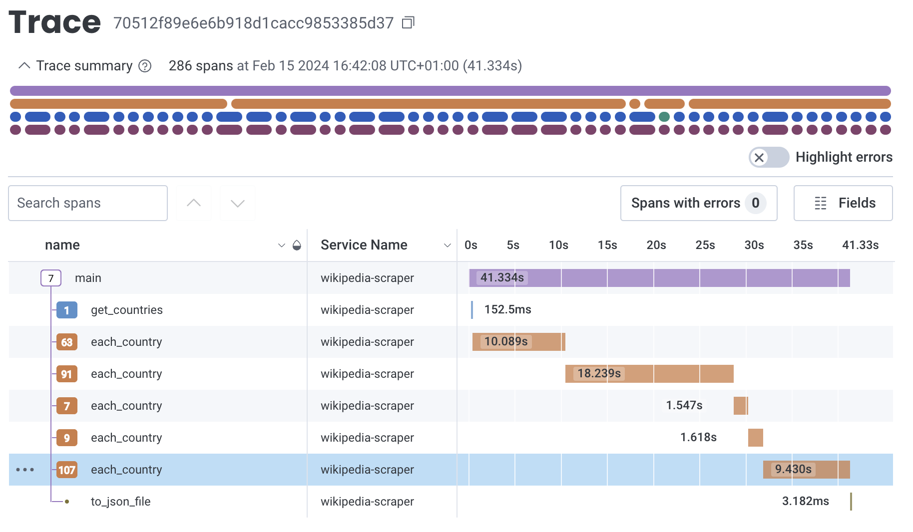
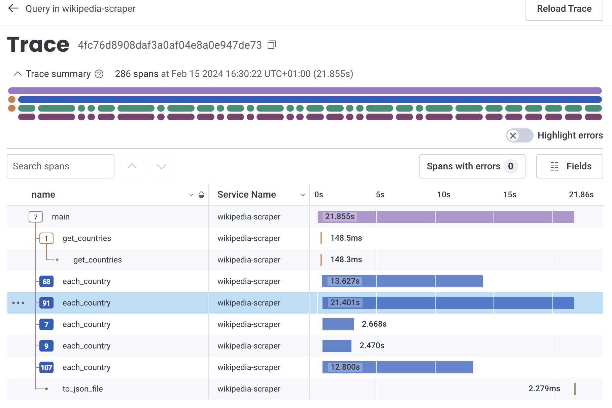
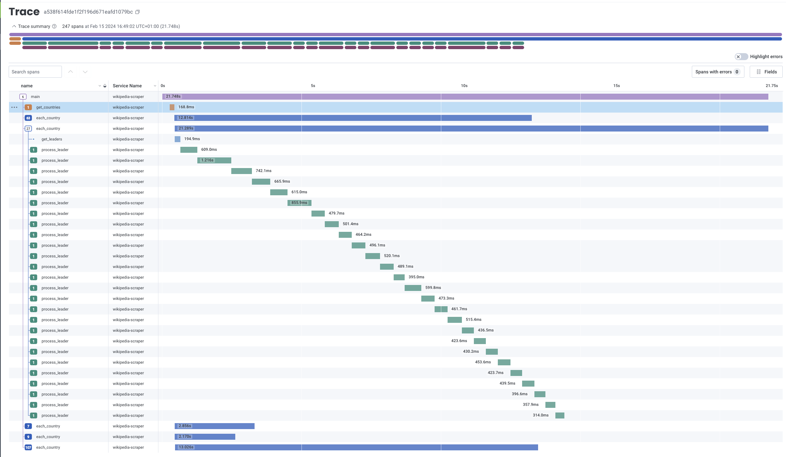
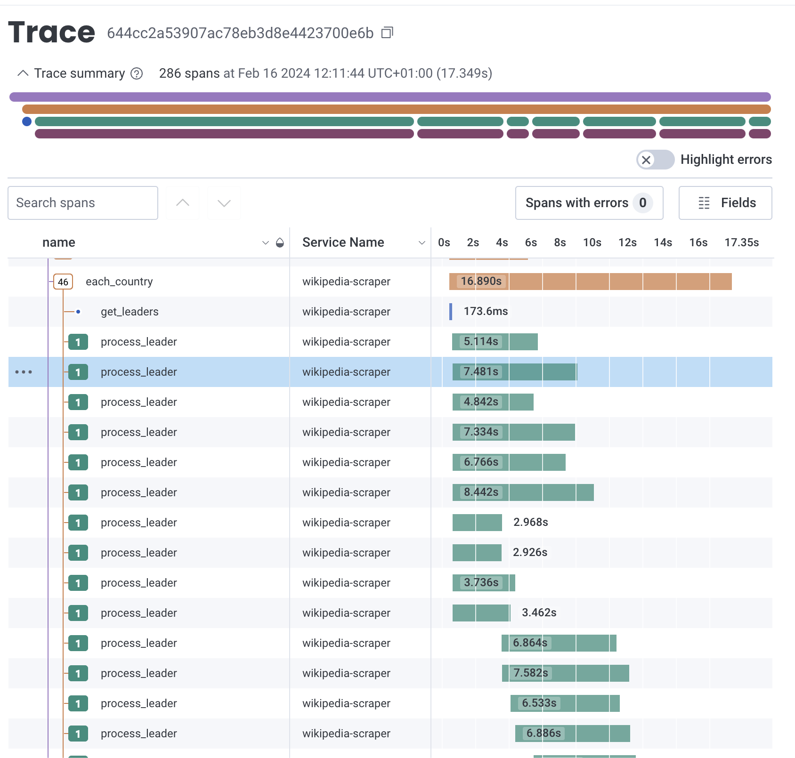

# 🚧 WORK-IN-PROGRESS 🚧
This is an exploratory branch. Go to the main branch README for a full description of this project.

## Observability
I'm using this project to explore how to instrument code for observability purposes. 

I'm testing the free version of the observability backend from [Honeycomb.](https://www.honeycomb.io/product-overview) 
The specific use case is to look at how exactly is my code executing before and after my first attempt at implementing concurrency to improve runtime.


## Example 1

For this particular code block:
```

...

```

This is how sequential execution looks like (runtime: 41.33s), as visualised in Honeycomb:





and this is how paralell execution looks like (runtime: 21.85s), also visualised in Honeycomb:




## Example 2

For this particular code block:
```

...

```

This is how the execution looks like before:



and this is how it looks after:




## Virtual environment
To create the env:
`python3 -m venv wikipedia_scraper_env`

To activate the env:
`source wikipedia_scraper_env/bin/activate`

## Installation

To install the required packages & dependencies, run the following command:

  ```bash
  pip3 install -r requirements.txt
  ```
## Usage

To run the program, execute the following command:

  ```bash
  export OTEL_SERVICE_NAME="wikipedia-scraper"
  export HONEYCOMB_API_KEY="xxxxxxxxxxxxxxxxxxxxxxxxxxxxxxxx" # get your free key from https://ui.honeycomb.io/
  opentelemetry-instrument python3 main.py
  ```
